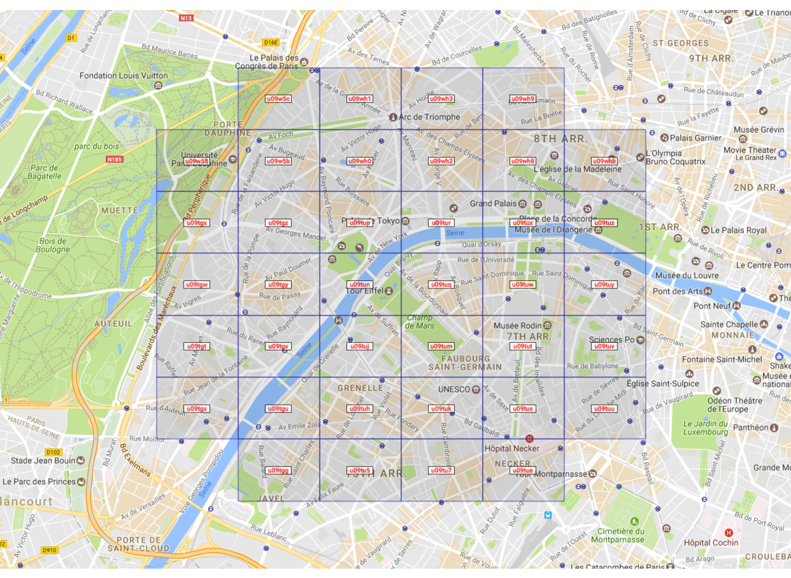

# go version of proximity hash

ProximityHash(go): Geohashes in Proximity (with the option of compression util)
this package is a port of [ashwin711/proximityhash](https://github.com/ashwin711/proximityhash)


Geohash is a geocoding system invented by Gustavo Niemeyer and placed into the public domain. It is a hierarchical spatial data structure which subdivides space into buckets of grid shape, which is one of the many applications of what is known as a Z-order curve, and generally space-filling curves.

**ProximityHash** generates a set of geohashes that cover a circular area, given the center coordinates and the radius. It also has an additional option to use **GeoRaptor** that creates the best combination of geohashes across various levels to represent the circle, starting from the highest level and iterating till the optimal blend is brewed. Result accuracy remains the same as that of the starting geohash level, but data size reduces considerably, thereby improving
speed and performance.


Example
-------

$ proximityhash 48.858156 2.294776 1000 7


$ proximityhash 48.858156 2.294776 2000 7 --georaptor true


$ proximityhash 48.858156 2.294776 2000 7 --georaptor true --minlevel 3 --maxlevel 6




Installation
------------

To install proximityhash, simply

`go get github.com/echoface/proximityhash`

API:

```go
package proximityhash

// CompressGeoHash compress api, merge geohash codes as most as possible
func CompressGeoHash(codes []string, minPrecision, cutoffPrecision int) []string

// CreateGeohash generate geohash codes that cover a circular area
func CreateGeohash(latitude, longitude, radius float64, precision uint) []string

```

License:
--------

Licensed under the MIT License


Contributors:
-------------

- gonghuan.dev@gmail.com [https://github.com/echoface]
